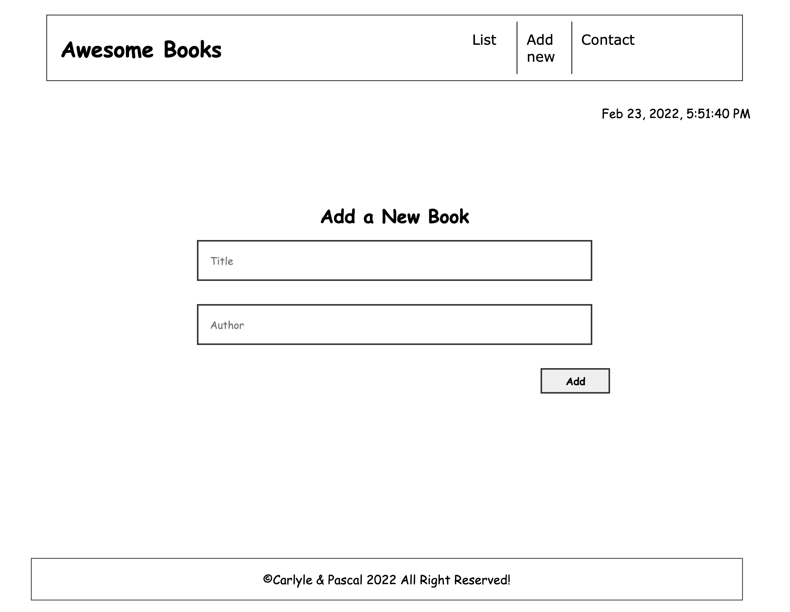
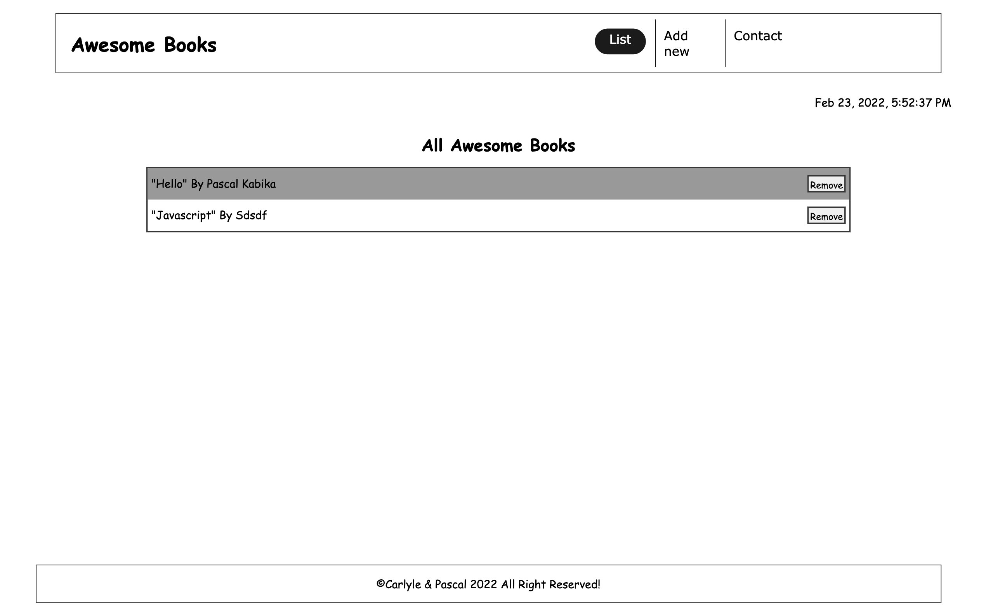

# Awesome Books with ES6 Integration

> Kindy have a look on these differents screens below

## Built With

- ES6
- Node Package Manager (npm)
- HTML
- CSS
- Javascript

## Live Demo

## Getting Started

To get a local copy up and running follow these simple example steps.

### Prerequisites

Computer with chrome or other browsers are needed to run the app localy.

### Setup, Install, and Usage

Proceed to follow these steps:

Follow these steps:

- Create a folder in the local storage of your computer which will contain the repository;
- open your browser and go to [the project's repository on github](git@github.com:KABIKA681/ES6.git);
- Click on the `code button` and copy the ssh or http links that are provided on the dropdown;
- open terminal or commandline from the folder you created in the first step, and type in the command, "git clone " and then paste the link.

## Authors

👤 **PASCAL KABIKA MP.**

- GitHub: [KABIKA681](https://github.com/KABIKA681?tab=overview&from=2021-12-01&to=2021-12-31)
- LinkedIn: (https://www.linkedin.com/in/pascal-kabika-443061220/)

## 🤝 Contributing

Contributions, issues, and feature requests are welcome!

## Show your support

Give a ⭐️ if you like this project!

## Acknowledgments

- Hat tip to the Microverse team for the guidance and reviews.

## 📝 License

This project is [MIT](./MIT.md) licensed.
